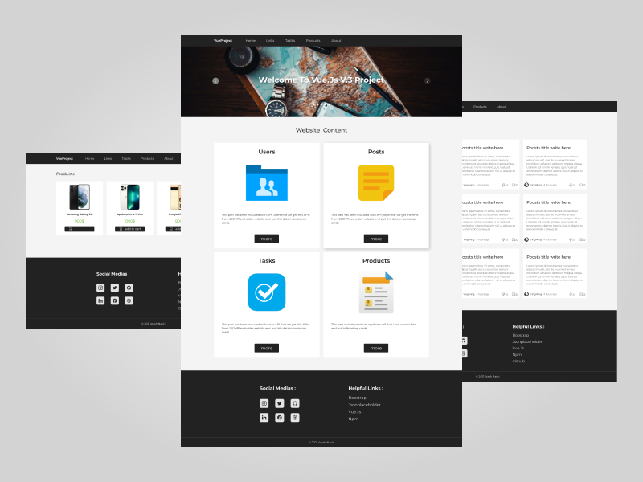

# Vue Project

Vue web application project that includes product, user, post and task sections. The information of this project is using fake data and is made with fake api. This project is able to create posts or tasks and even the ability to edit and delete posts. 


## What inbuilt functions and technologes are we going to focus on?
-   Vue.js v3 Composition API
-   Vue Router 
-   Vuex
-   Bootstarp
-   Axios
-   npm
-   Webpack
-   LocalStorage


## Project setup
```
npm install
```

### Compiles and hot-reloads for development
```
npm run serve
```

### Compiles and minifies for production
```
npm run build
```

### Lints and fixes files
```
npm run lint
```
Arash Nasiri - 2021